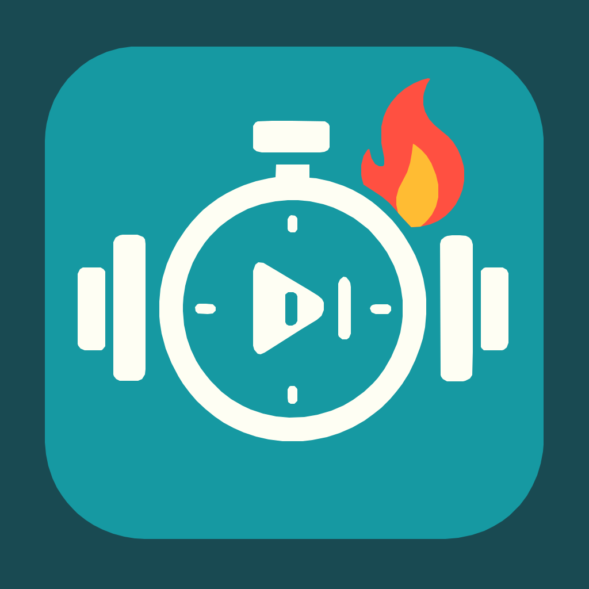

<div align="center">
  

  # Tabata Timer

  A modern, responsive Tabata timer built with React, TypeScript, and Vite. Features customizable workout settings, visual progress indicators, and audio cues.

  [](https://github.com/george-aidonidis/tabata-flow/actions/workflows/test.yml)

</div>

## ✨ Features

- **Customizable Settings**: Configure work intervals, rest periods, sets, and rounds
- **Visual Progress**: Circular progress ring and dot indicators for tracking workout progress
- **Audio Cues**: Web Audio API-powered sound notifications for phase transitions
- **Responsive Design**: Works seamlessly on desktop and mobile devices
- **Dark Theme**: Optimized for low-light workout environments

## 🚀 Getting Started

### Prerequisites

- Node.js 20+
- npm

### Installation

```bash
# Clone the repository
git clone <your-repo-url>
cd tabata-cursor

# Install dependencies
npm install

# Start development server
npm run dev
```

Visit `http://localhost:5173` to see the app.

## 📦 Available Scripts

```bash
npm run dev          # Start development server
npm run build        # Build for production
npm run preview      # Preview production build
npm run lint         # Run ESLint
npm run typecheck    # Run TypeScript checking
npm run test         # Run unit tests
npm run test:ui      # Run tests with UI
npm run test:e2e     # Run E2E tests with Playwright
npm run storybook    # Start Storybook
npm run test:storybook # Run Storybook screenshot tests
```

## 🧪 Testing

This project includes comprehensive testing:

- **Unit Tests**: Vitest for component and hook testing
- **E2E Tests**: Playwright for end-to-end testing
- **Visual Testing**: Storybook with screenshot testing
- **CI/CD**: GitHub Actions with parallel test execution

## 🎨 Storybook

Component stories are available for development and testing:

```bash
npm run storybook
```

Visit `http://localhost:6006` to browse component stories.

## 🏗️ Tech Stack

- **Frontend**: React 19, TypeScript
- **Build Tool**: Vite
- **Styling**: CSS Modules
- **Testing**: Vitest, Playwright, Storybook
- **Linting**: ESLint, Prettier
- **CI/CD**: GitHub Actions

## 📱 Usage

1. **Settings**: Configure your workout parameters
   - Work interval duration
   - Short/long break durations
   - Number of sets per round
   - Number of rounds

2. **Timer**: Start your workout
   - Visual progress with color-coded phases
   - Audio cues for phase transitions
   - Progress dots showing current set/round

## 🤝 Contributing

1. Fork the repository
2. Create a feature branch
3. Make your changes
4. Ensure all tests pass: `npm run test && npm run test:e2e`
5. Submit a pull request

## 📄 License

MIT License - see LICENSE file for details.

## 👨‍💻 Author

Made with ❤️ by [George](https://iamgeorge.dev/)
